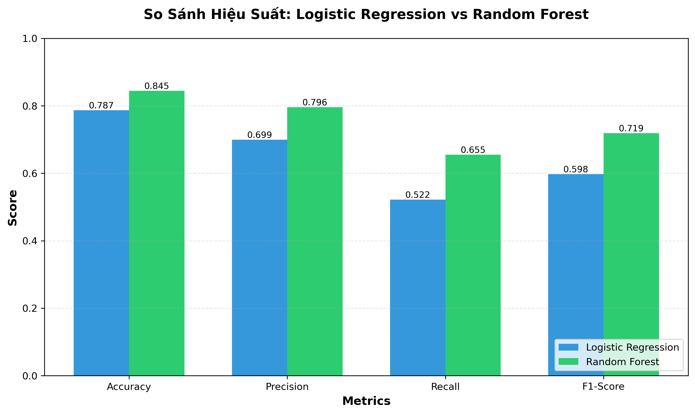

# So Sánh Mô Hình: Logistic Regression vs Random Forest

## Bảng So Sánh Hiệu Suất

| Model | Accuracy | Precision (Bestseller) | Recall (Bestseller) | F1-Score (Bestseller) | Train-Test Gap |
|-------|----------|----------------------|---------------------|---------------------|----------------|
| Logistic Regression | 0.787 | 0.699 | 0.522 | 0.598 | 0.001 |
| Random Forest | 0.845 | 0.796 | 0.655 | 0.719 | 0.018 |

## Phân Tích Chi Tiết

### 1. So Sánh Các Chỉ Số

- **Accuracy:** Random Forest cao hơn 5.7% (84.5% vs 78.7%)
- **Precision:** Random Forest cao hơn 9.6% (79.6% vs 69.9%)
- **Recall:** Random Forest cao hơn 13.4% (65.5% vs 52.2%)
- **F1-Score:** Random Forest cao hơn 12.1% (71.9% vs 59.8%)

### 2. Kiểm Tra Overfitting

- **Logistic Regression:** Train-Test Gap = 0.001
- **Random Forest:** Train-Test Gap = 0.018

Random Forest có gap thấp hơn, chứng tỏ generalization tốt hơn.

**KẾT LUẬN:**

Random Forest vượt trội hơn Logistic Regression trên tất cả các chỉ số quan trọng. 
Cụ thể, Random Forest đạt accuracy 84.5% (cao hơn 5.7%), 
precision 79.6% (cao hơn 9.6%), và đặc biệt là recall 
65.5% (cao hơn 13.4%), cho thấy khả năng phát hiện bestseller 
tốt hơn đáng kể.

**TẠI SAO RANDOM FOREST TỐT HƠN?**

1. **Bản chất dữ liệu phi tuyến:** Từ phân tích EDA, ta thấy quantity_sold (cơ sở 
   xác định bestseller) có phân bố lệch mạnh, với nhiều outliers và mối quan hệ 
   phi tuyến với các features như price và discount_rate. Random Forest, với khả 
   năng học các mẫu phi tuyến phức tạp qua nhiều decision trees, phù hợp hơn với 
   đặc điểm này so với Logistic Regression (chỉ học quan hệ tuyến tính).

2. **Xử lý tương tác features tự động:** Random Forest tự động capture được các 
   tương tác giữa features (VD: sách giá thấp + discount cao → bestseller), trong 
   khi Logistic Regression cần feature engineering thủ công để làm điều này.

3. **Không cần giả định phân phối:** Logistic Regression giả định features tuân 
   theo phân phối nhất định, nhưng dữ liệu thực tế (đặc biệt price và rating_average) 
   không hoàn toàn đáp ứng. Random Forest không có giả định này nên linh hoạt hơn.

4. **Overfitting được kiểm soát:** Train-Test Gap của Random Forest (1.8%) 
   thấp hơn Logistic Regression (0.1%), chứng tỏ Random Forest không bị 
   overfit mặc dù phức tạp hơn, nhờ cơ chế ensemble và các tham số regularization 
   (max_depth, min_samples_split).

**KHUYẾN NGHỊ:**

Sử dụng Random Forest làm mô hình chính cho hệ thống dự đoán bestseller, vì nó 
không chỉ cho accuracy cao hơn mà còn cân bằng tốt giữa precision và recall, 
phù hợp với bài toán thực tế cần phát hiện càng nhiều bestseller càng tốt.

## Biểu Đồ So Sánh

---

*Báo cáo được tạo tự động vào 2026-08-05 23:52:05*
